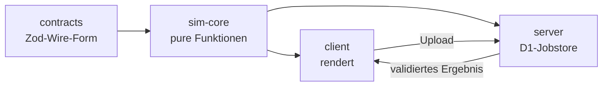

<!-- markdownlint-disable MD033 MD041 -->
<div align="center">

<pre>
███████╗███████╗███████╗██████╗     ████████╗██╗  ██╗███████╗    ███████╗
██╔════╝██╔════╝██╔════╝██╔══██╗    ╚══██╔══╝██║  ██║██╔════╝    ██╔════╝
█████╗  █████╗  █████╗  ██║  ██║       ██║   ███████║█████╗      █████╗
██╔══╝  ██╔══╝  ██╔══╝  ██║  ██║       ██║   ██╔══██║██╔══╝      ██╔══╝
██║     ███████╗███████╗██████╔╝       ██║   ██║  ██║███████╗    ██║
╚═╝     ╚══════╝╚══════╝╚═════╝        ╚═╝   ╚═╝  ╚═╝╚══════╝    ╚═╝
██╗      ██████╗  ██████╗ ██████╗
██║     ██╔═══██╗██╔═══██╗██╔══██╗
██║     ██║   ██║██║   ██║██████╔╝
██║     ██║   ██║██║   ██║██╔══██╗
███████╗╚██████╔╝╚██████╔╝██║  ██║
╚══════╝ ╚═════╝  ╚═════╝ ╚═╝  ╚═╝
</pre>

# ⛏️ Feed the Floor: Meet Your Fate

**Oben bist du der freundliche Bürgermeister.**
**Unten bist du der Dungeon Master. Beides bist du.**

[](https://github.com/vannon091118/Feed-the-Floor-Bleed/actions/workflows/shinon.yml)


</div>

---

Du schließt die Augen, um schlafen zu gehen. Du träumst von einem Dorf. Im
Traum verteilst du Brot, die Arbeiter kommen, die Gilde wächst. Alles ist warm
und du bist ein guter Mensch.

Dann machst du die Augen auf — und stehst in deinem **eigenen** Dungeon. Die
Helden, die du gestern ausgewildert hast, stehen vor deiner Tür. Sie wollen
wissen, ob dein „sicheres Dorf" überhaupt etwas wert ist.

Es ist. Es ist sogar furchtbar effizient.

**Feed the Floor** ist ein persistentes, asynchrones Webspiel: kein
Echtzeit-MMO, keine Energie-Balken, kein Timer, der dich maßregelt. Nur ein
Dorf, ein Dungeon, Monster, die aus jeder Niederlage lernen — und die Frage, wie
tief du bereit bist zu graben.

> 💀 Die Helden glauben, sie würden dein Dorf retten. Dann stehen sie in deinem
> Dungeon, und deine Monster lernen aus jedem Kampf, den sie verlieren.
> Dein Problem.

---

## 🩸 Was dich erwartet

- 🏘️ **Bürgermeister-Loop** — du lächelst, du verteilst Brot, du versprichst
  Arbeit, Schutz und einen bescheidenen Lohn. Dein Dorf wächst. Oder es tut zum
  mindest so.
- 🕳️ **Dungeon-Master-Loop** — der Floor hungert, also gibst du ihm Monster. Du
  züchtest sie, schickst sie in die Etagen und baust aus Wänden, Fallen und einem
  Boss eine Einladung, die niemand ablehnen kann.
- ⚔️ **Der Raid läuft von selbst** — die Helden sind zu *keinem* Zeitpunkt
  spielergesteuert. Du drückst los, sie kämpfen. Ziel ist immer dasselbe eine:
  den Boss besiegen.
- 🧬 **Zucht, die aus Verlusten lernt** — besiegte Monster sterben nicht, sie
  verlieren Moral und werden inaktiv. Aber sie leveln bei *jedem* Kampf, auch
  bei dem, den sie verlieren.
- 💰 **Phantom-Beute** — wenn die Helden deinen Boss plündern, nehmen sie eine
  Kopie. Deine echten Ressourcen bleiben, wo sie sind. (Absicht, kein Bug.)
- 🧱 **Echtes Bauen mit Konsequenz** — freies Graben auf 64×64 Logikzellen pro
  Etage. Muss immer eine Route frei sein, sonst **Hard-Block**. Baue deine eigenen
  Umwege; die Helden werden sie trotzdem nehmen, weil sie den kürzesten Weg
  suchen.
- 🌗 **Tag / Nacht, du drückst den Knopf** — kein Server entscheidet deinen
  Feierabend.
- 🚫 **Kein Energy-Timer, kein Battle-Pass, kein Pay-to-Win** — es gibt nur dich,
  deine Monster und die Frage, wie tief du gräbst.

---

## 🧭 Ehrlicher Ist-Zustand

Wir halten nichts zurück: was wirklich läuft und was noch in der Rohrleitung
liegt. Das Repo behauptet nie, geplante Systeme seien schon da.

<details>
<summary><b>✅ Gebaut und getestet</b> — läuft heute</summary>

- **Deterministischer Kampf-Core** — Fixed-Point statt Float, Seed-PRNG
  (Mulberry32), A*-Pathfinding mit festem Tie-Break, Combat-Ticks, kanonischer
  Log-Hash.
- **Trail-Hash** — der *komplette* Pfad (Koordinate **und** Zelltyp je
  Schritt) fließt in den Kampf-Hash. Zwei gleich lange Umwege liefern jetzt
  unterschiedliche Werte.
- **Contract-v3** — Zod-Schemas, `sim_version`, Ergebnislog, Auftragsautomaten
  (`RAID_JOB_STATUSES` / `RAID_JOB_TRANSITIONS`) und TTL kommen aus
  `packages/contracts` — der Code erfindet sie nicht.
- **Replay-Validierung** — der geparste Log wird inklusive Trail-Prüfung
  nachgerechnet.
- **Sichtbare Referenzszene** — PixiJS 8, Kamera, Ebenen, Depth, Occlusion,
  Actors, FX, Lichte; DOM-basierter Dungeon-Editor; Preact-Fenster-Runtime mit
  Fokus, Z-Order, Drag, Resize. Der Client *rendert* — er entscheidet nie.
- **Lokaler Fixture-Raid** — Editor-Grid + Aufstellung → Upload → `runFixtureRaid`
  prüft Schema, Auftragsfrist und Route und liefert einen validierten Auftrag.

</details>

<details>
<summary><b>🚧 Geplant — ehrlich markiert, noch nicht existent</b></summary>

Alles hier steht in `docs/ROADMAP.md` (T1–T3) und ist **noch nicht benutzbar**.

- **T1.1 (als Nächstes)** — Raid-Playback: Timeline, Routen- und Fallenenereignisse,
  Schlussfolgen. Der Dungeon steckt jetzt im Hash, die Timeline kann ihn abspielen.
- **Dorf-Ökonomie** — Arbeiter, Attraktivität, Materialbedarf, Landkauf.
- **Inventar & Ausrüstung** — 9 Slots, 5 Seltenheitsstufen, Zerlegen, sichtbare
  Phantom-Beute.
- **Zucht-UI** — Generationen, Mutationen, reproduzierbare Stammbäume,
  moralgetriebene Reaktivierung.
- **Echter Async-Multiplayer** — HTTP, Auth, Queue, D1-Jobstore, Reconnect, Retry,
  Timeout, MMR-Matching und Ghost-Fallback.
- **PWA & Deployment** — Dexie-Stand, Offline-Editor, produktionsfähige Config.

> 🎲 MMR-Band (±10 %), Ghost-Seed, 15-Minuten-TTL und ein Vier-Stunden-Shield
> sind **[K]**-Vorschläge — vom Nutzer nicht abgenickt, also **keine** Spielregel.

</details>

---

## 🏗️ Unter der Haube

<details>
<summary><b>Architektur — vier Schichten, eine Wahrheit</b></summary>



- `contracts` — besitzt die Protokoll-Form: Zod-Schemas, Protokollversionen,
  Fehlercodes, Statusautomaten. Keine Logik.
- `sim-core` — besitzt die Berechnung: Grid, Pathfinding, Kampf, Hash, Replay,
  Zucht-Maschine. Kein I/O, keine Uhr, kein Zufall von außen — Zeit und Seed sind
  Parameter.
- `client` — Preact + Signals für die UI, PixiJS 8 für die laufende Szene. Rendert
  ausschließlich serverseitig validierte Ergebnisse.
- `server` — Cloudflare D1 (Snapshots, Scores, Jobstatus) + Queues. Setzt den
  Contract durch, erfindet nichts.

Ein `modularity-gate` erzwingt die Grenzen mechanisch: `contracts` darf nur `zod`
importieren, der Client importiert nie den Server, und `worldToScreen` /
`screenToWorld` existiert genau *einmal* im Repo.

</details>

<details>
<summary><b>Der deterministische Anspruch — kurz und ernst gemeint</b></summary>

In `sim-core` und `contracts` sind `Math.random`, `crypto.randomUUID`,
`crypto.getRandomValues`, `Date.now`, `new Date()`, `Math.sin/cos/tan/sqrt/pow`
und `parseFloat` **verboten**. Ersatz: `createRng(seed)`, `intSqrt`/`mulFixed`,
Zeit und Seed als Parameter. Ein `core-determinism`-Gate prüft das bei jedem
Commit.

> 🧠 Wer `Date.now()` in den Core schmuggelt, bekommt ein rotes Gate und keine
> Ausrede. Determinismus ist hier kein Feature, sondern die Grundlage — ein
> replaysicherer Raid ist nur wertlos, wenn derselbe Seed zweimal zwei
> verschiedene Ergebnisse liefert.

</details>

<details>
<summary><b>Der Stapel</b></summary>

| Bereich | Werkzeug |
|---|---|
| Sprache | TypeScript 5.6, strikt |
| Pakete | pnpm 9.12.3 (Monorepo, nur pnpm) |
| UI | Preact + Signals |
| Rendering | PixiJS 8 (Ebenen, Depth, Occlusion, FX, Filter) |
| Editor | DOM/Preact-Raster, Pinsel, Single-Owner-State |
| Schemas | Zod |
| Server | Cloudflare D1 + Queues (Worker) |
| Datenbank | D1 + Migrationen |
| Tests | Vitest |
| Lint / Format | Biome (2 Leerzeichen, einfache Quotes) |
| Gates | Shinon (Slice-Runner) + Git-Hooks + GitHub Actions |

</details>

---

## 🎮 Die Schleife

```
Tag    →  Dorf:  Brot verteilen, Arbeiter anlocken, Gold verwalten
   ↓     (du drückst den Knopf — kein Timer entscheidet das)
Nacht  →  Floor: Monster züchten, Etagen graben, Wände, Fallen & Boss bauen
   ↓
Raid   →  Dein Angriff auf einen fremden Floor. Läuft automatisch. Ziel: der Boss.
   ↓
Lernen →  Besiegte Monster verlieren Moral — leveln aber trotzdem.
   ↺  zurück zum Tag
```

<details>
<summary><b>Die Kernregeln (nur <code>[N]</code> ist fix)</b></summary>

- Das Dorf startet bei 10×10 Tiles und wächst **horizontal** per Landkauf.
- Das Dungeon hat pro Etage 64×64 Logikzellen, wächst **nur vertikal**; jede
  Etage ist eine eigene Map.
- Die Heldengruppe ist maximal 5 stark; Ziel ist *immer* der Boss. Die Helden
  sind zu *keinem* Zeitpunkt spielergesteuert.
- Man greift nie den eigenen Dungeon an. Ein eigener Angriff stellt automatisch
  den eigenen Floor in den globalen Pool.
- Der Angreifer plündert eine **Phantom-Kopie**; der Verteidiger verliert keine
  Live-Ressourcen.
- Nach einem *vollständigen oder abgebrochenen* Raid wird der Angreifer lokal für
  diesen einen Verteidiger gesperrt. Ein Abbruch zählt mit.
- Kein Handel, keine Monetarisierung beim Launch: keine Paywalls, keine sicheren
  Rolls, keine Roll-Caps, kein Pay-to-Win. Später höchstens Kosmetik oder
  Status-Rerolls.

</details>

---

## 🔧 Loslegen

<details>
<summary><b>Befehle</b></summary>

```bash
pnpm install --frozen-lockfile   # Abhängigkeiten (pnpm ist Pflicht, kein npm)
pnpm dev                         # Client-Devserver (Vite)
pnpm build                       # Produktions-Build des Clients
pnpm test                        # Vitest-Einmal-Lauf
pnpm run -s typecheck            # tsc --noEmit
pnpm run -s lint                 # Biome
pnpm run -s check                # Vollabnahme: typecheck + LOC + Hygiene + alle Gates
```

Node ≥ 22. Nur pnpm — kein npm, kein yarn, keine manuelle `package-lock`.

</details>

<details>
<summary><b>In vier Schritten rein</b></summary>

1. **Installieren** — `pnpm install --frozen-lockfile`
2. **Ansehen** — `pnpm dev`, Browser auf localhost. Die Referenzszene rechnet
   einen echten lokalen Fixture-Raid aus.
3. **Graben** — im DOM-Editor ein 64×64-Grid bemustern, eine Route frei halten
   (sonst Hard-Block), den Boss platzieren.
4. **Raid auslösen** — Aufstellung bauen, Upload, Ergebnis ansehen.
   Determinismus heißt: gleiche Eingabe, gleicher Hash, immer.

</details>

---

## 🛡️ Governance — kurz, weil sie lang ist

Dieses Repo nimmt sich selbst ernst. Das ist Absicht.

<details>
<summary><b>Shinon: Gate-Engine und Test-Suite in einem</b></summary>

- `pre-commit` — Slice-basierter Runner: Base-Gates immer, Core-Tests nur, wenn
  der Slice sie wirklich braucht.
- `commit-msg` — der Commit-Body braucht **≥ 200 Wörter Fließtext**, keine
  Aufzählungen, keine verbotenen Footer und **nennt jede geänderte Datei
  namentlich**.
- `post-commit` — mechanischer Versions-Bump + Amend + Auto-Push.
- `pre-push` — die volle Suite als letzte Sicherung.
- **GitHub Actions** — `Shinon` wiederholt den Full-Check bei jedem Push auf
  `main` und jedem PR. Das ist die verbindliche *Fern*-prüfung; die Hooks allein
  sind kein Schutz, `--no-verify` der kürzeste Weg ins Rote.

Ein Task = ein Commit = ein Push-Slice. Kein Sammelcommit, kein Bypass.

</details>

<details>
<summary><b>Was die Gates überwachen</b></summary>

| Gate | Wacht über |
|---|---|
| `loc-gate` / `global-loc-gate` | harte LOC-Caps je Ownership — Slop wird gesplittet, nicht umgangen |
| `hygiene-gate` | Pflicht-Doku: Changelog, Architektur, Stringmatrix, Funktionsgraph, Repoindex |
| `modularity-gate` | Domänen-Grenzen, Deep-Imports, Import-Zyklen |
| `core-determinism` | kein `Math.random` / `Date.now` / Float im Core |
| `dead-code-gate` | TypeScript-NoUnused + Dead-Code-Muster |
| `redundancy-gate` | keine duplizierten Sechs-Zeilen-Blöcke |
| `schema-contract` | Zod-Contracts, `sim_version`, Protokoll-Keys |
| `version-gate` | `VERSION` synchron zu allen `package.json` |
| `commit-integrity` | die *echten* Commits der Range — die nicht umgehbare Fernprüfung |

</details>

<details>
<summary><b>Wenn du mitwirken willst</b></summary>

- Eine Datei = ein Job. Kein God-File, kein Util-Sumpf.
- Ein Helper gehört in genau eine Datei und wird importiert (kein Copy-Paste).
- Keine Änderung ohne Doku-Touch.
- Alles auf **Deutsch** — Doku, Kommentare, Commits, Dev-Fehlermeldungen.
- Eine Regel wirklich brechen? **Frag vorher.** Kein stilles Scope-Creep, kein
  nachträgliches Verschieben von Roadmap-Punkten.

</details>

---

## 🗺️ Doku — die README ist Werbung, das hier ist Wahrheit

Wenn du nach dem *Wie* suchst, bist du hier richtig. Wenn du nach dem *Was* suchst,
scroll nach oben.

| Datei | Worum es geht |
|---|---|
| [`docs/ROADMAP.md`](docs/ROADMAP.md) | die einzige aktive Reihenfolge — T1 exklusiv, danach T2 → T1, T3 → T2 |
| [`docs/CONCEPT_REVIEW.md`](docs/CONCEPT_REVIEW.md) | die einzige Quelle für Spielregeln — `[N]` fix, `[K]` Vorschlag, `[O]` offen |
| [`docs/ARCHITEKTUR.md`](docs/ARCHITEKTUR.md) | Schichten, Datenfluss, Owner-Grenzen |
| [`docs/STRINGMATRIX.md`](docs/STRINGMATRIX.md) | feste IDs, Protokoll-Keys, Item-Traits, Fehlercodes |
| [`Agents.md`](Agents.md) | **das Gesetz.** Sprache, Architektur, LOC-Caps, Hooks, Gates |
| [`packages/contracts/docs/`](packages/contracts/docs/ARCHITEKTUR.md) | Protokoll-Form, Statusautomaten, Fehlercodes |
| [`packages/sim-core/docs/`](packages/sim-core/docs/ARCHITEKTUR.md) | der deterministische Core |
| [`packages/client/docs/`](packages/client/docs/ARCHITEKTUR.md) | Pixi, Preact, Editor, Fenster-Runtime |
| [`packages/server/docs/`](packages/server/docs/ARCHITEKTUR.md) | D1, Jobstore, Sync |

> 📌 **Zwei Modi, eine Regel.** Das README ist die Verkaufsbühne — Vision, Humor,
> Augenschmuck. Die Technik ist Doku, nicht Werbung. Wer eine Spielregel ändern
> will, ändert `docs/CONCEPT_REVIEW.md` mit Markern — nicht diese Datei.

</details>

---

## ⚖️ Status & Lizenz

- **Status:** Pre-Alpha. Der deterministische Core steht, der sichtbare
  Szenenaufbau steht, der volle Raid-Loop ist in Arbeit. Erwarte noch keinen
  fertigen Multiplayer-Stack.
- **Lizenz:** Noch keine vergeben — das Repo ist aktuell proprietär. Bevor
  irgendetwas Öffentliches passiert, kommt eine Lizenz hier rein, zusammen mit
  einem `LICENSE`-File.
- **Mitmachen:** Issues und Diskussion willkommen. Contributions nach den Regeln
  in [`Agents.md`](Agents.md) — die sind nicht verhandelbar, aber die Gates
  erklären sich selbst.

---

<div align="center">

<sub>

**Werde Bürgermeister. Füttere den Floor. Bau den Dungeon, den deine Gegner nicht verdienen.**


</sub>

</div>
