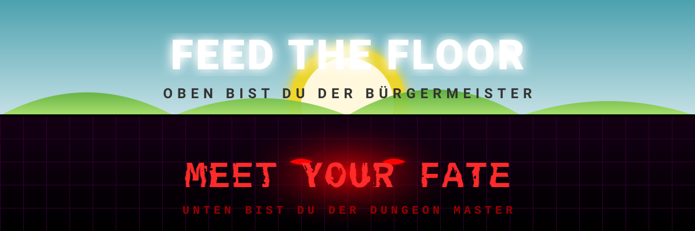
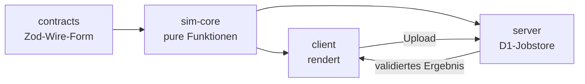

<!-- markdownlint-disable MD033 MD041 -->
<div align="center">

<picture>
  
</picture>

<br/>

**Oben bist du der freundliche Bürgermeister.**
**Unten bist du der Dungeon Master. Beides bist du.**

[](https://github.com/vannon091118/Feed-the-Floor-Bleed/actions/workflows/shinon.yml)


</div>

---

> 📜 **CODE IS TRUTH. DOKU IST PRÄZISE.** Es gibt nur *eine* Wahrheit. Keine Widersprüche. Dieses Repository duldet keine Halbwahrheiten. Wenn der Code etwas anderes sagt als die Doku, ist die Doku falsch. Wenn die Doku etwas anderes sagt als der Code, ist der Code falsch. Wir beheben es.

Du schließt die Augen, um schlafen zu gehen. Du träumst von einem Dorf. Im Traum verteilst du Brot, die Arbeiter kommen, die Gilde wächst. Alles ist warm und du bist ein guter Mensch.

Dann machst du die Augen auf — und stehst in deinem **eigenen** Dungeon. Die Helden, die du gestern ausgewildert hast, stehen vor deiner Tür. Sie wollen wissen, ob dein „sicheres Dorf" überhaupt etwas wert ist.

Es ist. Es ist sogar furchtbar effizient.

**Feed the Floor** ist ein persistentes, asynchrones Webspiel: kein Echtzeit-MMO, keine Energie-Balken, kein Timer, der dich maßregelt. Nur ein Dorf, ein Dungeon, Monster, die aus jeder Niederlage lernen — und die Frage, wie tief du bereit bist zu graben.

> 💀 **Dein Problem:** Die Helden glauben, sie würden dein Dorf retten. Dann stehen sie in deinem Dungeon, und deine Monster lernen aus jedem Kampf, den sie verlieren.

---

<div align="center">
  
</div>

### 🎭 Die zwei Gesichter deines Alltags

| 🏘️ Oben: Bürgermeister-Loop | 🕳️ Unten: Dungeon-Master-Loop |
| :--- | :--- |
| Du lächelst, du verteilst Brot, du versprichst Arbeit, Schutz und einen bescheidenen Lohn. Dein Dorf wächst. Oder es tut zumindest so. | Der Floor hungert, also gibst du ihm Monster. Du züchtest sie, schickst sie in die Etagen und baust aus Wänden, Fallen und einem Boss eine Einladung, die niemand ablehnen kann. |

### ⚙️ Die Mechanik des Leidens

- ⚔️ **Der Raid läuft von selbst** — Die Helden sind zu *keinem* Zeitpunkt spielergesteuert. Du drückst los, sie kämpfen. Ziel ist immer dasselbe: den Boss besiegen.
- 🧬 **Zucht, die aus Verlusten lernt** — Besiegte Monster sterben nicht, sie verlieren Moral und werden inaktiv. Aber sie leveln bei *jedem* Kampf, auch bei dem, den sie verlieren.
- 💰 **Phantom-Beute** — Wenn die Helden deinen Boss plündern, nehmen sie eine Kopie. Deine echten Ressourcen bleiben, wo sie sind. *(Absicht, kein Bug. Wir sind grausam, aber fair.)*
- 🧱 **Echtes Bauen mit Konsequenz** — Freies Graben auf 64×64 Logikzellen pro Etage. Muss immer eine Route frei sein, sonst **Hard-Block**. Baue deine eigenen Umwege; die Helden werden sie trotzdem nehmen, weil sie den kürzesten Weg suchen.
- 🌗 **Tag / Nacht, du drückst den Knopf** — Kein Server entscheidet deinen Feierabend.
- 🚫 **Kein Bullshit** — Kein Energy-Timer, kein Battle-Pass, kein Pay-to-Win. Es gibt nur dich, deine Monster und die Frage, wie tief du gräbst.

---

<div align="center">
  
</div>

Wir halten nichts zurück: was wirklich läuft und was noch in der Rohrleitung liegt. Das Repo behauptet nie, geplante Systeme seien schon da. **Wir lügen nicht in der Doku.**

<details open>
<summary><b>✅ Gebaut und getestet — (Das ist die Wahrheit)</b></summary>

- **Deterministischer Kampf-Core** — Fixed-Point statt Float, Seed-PRNG (Mulberry32), A*-Pathfinding mit festem Tie-Break, Combat-Ticks, kanonischer Log-Hash.
- **Trail-Hash** — Der *komplette* Pfad (Koordinate **und** Zelltyp je Schritt) fließt in den Kampf-Hash. Zwei gleich lange Umwege liefern jetzt unterschiedliche Werte.
- **Contract-v3** — Zod-Schemas, `sim_version`, Ergebnislog, Auftragsautomaten und TTL kommen aus `packages/contracts` — der Code erfindet sie nicht.
- **Replay-Validierung** — Der geparste Log wird inklusive Trail-Prüfung nachgerechnet.
- **Sichtbare Referenzszene** — PixiJS 8, Kamera, Ebenen, Depth, Occlusion, Actors, FX, Lichte; DOM-basierter Dungeon-Editor; Preact-Fenster-Runtime. Der Client *rendert* — er entscheidet nie.
- **Lokaler Fixture-Raid** — Editor-Grid + Aufstellung → Upload → `runFixtureRaid` prüft Schema, Auftragsfrist und Route und liefert einen validierten Auftrag.

</details>

<details>
<summary><b>🚧 Geplant — (Noch nicht existent, aber auf dem Zettel)</b></summary>

Alles hier steht in `docs/ROADMAP.md` (T1–T3) und ist **noch nicht benutzbar**.

- **T1.1 (als Nächstes)** — Raid-Playback: Timeline, Routen- und Fallenenereignisse, Schlussfolgen.
- **Dorf-Ökonomie** — Arbeiter, Attraktivität, Materialbedarf, Landkauf.
- **Inventar & Ausrüstung** — 9 Slots, 5 Seltenheitsstufen, Zerlegen, sichtbare Phantom-Beute.
- **Zucht-UI** — Generationen, Mutationen, reproduzierbare Stammbäume, moralgetriebene Reaktivierung.
- **Echter Async-Multiplayer** — HTTP, Auth, Queue, D1-Jobstore, Reconnect, Retry, Timeout, MMR-Matching und Ghost-Fallback.
- **PWA & Deployment** — Dexie-Stand, Offline-Editor, produktionsfähige Config.

> 🎲 MMR-Band (±10 %), Ghost-Seed, 15-Minuten-TTL und ein Vier-Stunden-Shield sind **[K]**-Vorschläge — vom Nutzer nicht abgenickt, also **keine** Spielregel.

</details>

### 📐 Architektur — Vier Schichten, eine Wahrheit


```mermaid
flowchart LR
  C["contracts\nZod-Wire-Form"] --> S["sim-core\npure Funktionen"]
  S --> CL["client\nrendert"]
  S --> SV["server\nD1-Jobstore"]
  CL -->|Upload| SV
  SV -->|validiertes Ergebnis| CL
```

Ein `modularity-gate` erzwingt die Grenzen mechanisch. `contracts` darf nur `zod` importieren, der Client importiert nie den Server, und `worldToScreen` / `screenToWorld` existiert genau *einmal* im Repo. 

> 🧠 **Determinismus ist hier kein Feature, sondern die Religion.** In `sim-core` und `contracts` sind `Math.random`, `crypto.randomUUID`, `Date.now`, und `parseFloat` **verboten**. Wer `Date.now()` in den Core schmuggelt, bekommt ein rotes Gate und keine Ausrede.

---

<div align="center">
  
</div>

Dieses Repo nimmt sich selbst ernst. Das ist Absicht. Die README ist die Verkaufsbühne — Vision, Humor, Augenschmuck. Die Doku im `docs/`-Ordner ist die nackte, unwiderlegbare Wahrheit.

| Datei / Gate | Das harte Gesetz |
| :--- | :--- |
| [`Agents.md`](Agents.md) | **Der absolute Einstieg.** Sprache, Architektur, LOC-Caps, Hooks, Gates. Was hier steht, ist Gesetz. |
| `Shinon` | Gate-Engine & Test-Suite. Ein Task = ein Commit = ein Push-Slice. Kein Bypass. |
| `hygiene-gate` | Zwingt dich zur Doku: Changelog, Architektur, Stringmatrix, Funktionsgraph, Repoindex. Keine Änderung ohne Doku-Touch. |
| `core-determinism` | Kein `Math.random` / `Date.now` / Float im Core. |

### 🔧 Rein in den Wahnsinn

Nur pnpm — kein npm, kein yarn. Node ≥ 22.

```bash
pnpm install --frozen-lockfile   # Abhängigkeiten
pnpm dev                         # Client-Devserver (Vite)
pnpm run -s check                # Vollabnahme: typecheck + LOC + Hygiene + alle Gates
```

<div align="center">

<br/>

<sub>
<b>Werde Bürgermeister. Füttere den Floor. Bau den Dungeon, den deine Gegner nicht verdienen.</b>
<br/><br/>


</sub>

</div>
