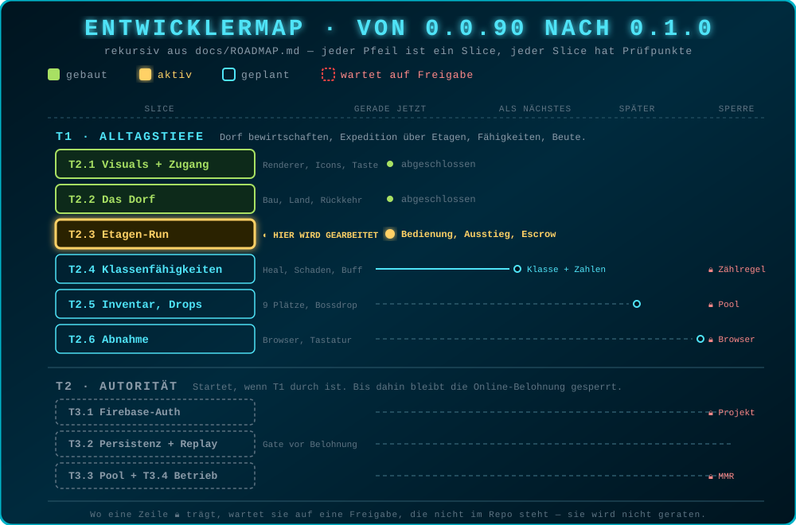
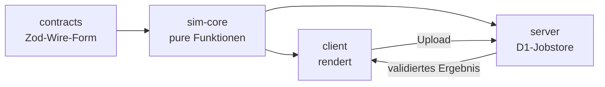

<!-- markdownlint-disable MD033 MD041 -->
<div align="center">

<picture>
  
</picture>

<br/>

**Oben bist du der freundliche Bürgermeister.**
**Unten bist du der Dungeon Master.**
**Du bist beides. Gleichzeitig. Und niemand weiß davon.**

<br/>

[](https://github.com/vannon091118/Feed-the-Floor-Bleed/actions/workflows/shinon.yml)


</div>

---

> *„Du schließt die Augen, um schlafen zu gehen. Du träumst von einem Dorf. Im Traum verteilst du Brot, die Arbeiter kommen, die Gilde wächst. Alles ist warm und du bist ein guter Mensch."*
>
> *Dann machst du die Augen auf.*
>
> *Und du stehst in deinem eigenen Dungeon. Dein Boss hat Kratzer. Irgendein Held hat letzte Nacht versucht, deine dritte Etage zu räumen. Er hat versagt, aber dein Wandmimic hat dabei ein Level aufgestiegen. Danke dafür, Fremder.*

---

## 💀 Was ist Feed the Floor?

**Feed the Floor** ist das Spiel, das ich bauen wollte, seit ich das erste Mal in einem Tower Defense dachte: *„Warum kann ich nicht auf der anderen Seite stehen?"*

Stell dir vor: **Dungeon Keeper** trifft **Idle RPG** trifft **Push-your-luck Raids** — aber asynchron, persistent und deterministisch bis auf den letzten Bit. Kein Echtzeit-MMO. Keine Energie-Balken. Kein Timer, der dir sagt, wann du spielen darfst. Kein Battle-Pass, der dich bestraft, weil du ein Leben hast.

Nur du. Dein Dorf. Dein Dungeon. Und die Frage, wie tief du bereit bist zu graben.

> 🎲 *Fun Fact: Der Kampf-Core rechnet in Fixed-Point-Ganzzahlen statt Floats. Weil ich paranoid bin. Weil `0.1 + 0.2 !== 0.3` in JavaScript. Und weil ein Replay, das beim zweiten Mal anders ausgeht, kein Replay ist, sondern eine Lüge.*

---

<div align="center">
  
</div>

<br/>

### ☀️ Am Tag bist du der Bürgermeister

Du lächelst. Du verteilst Brot. Du versprichst Arbeit, Schutz und einen bescheidenen Lohn.

Dein Dorf startet auf einem 10×10-Raster und wächst horizontal — per Landkauf, mit echten Ressourcen. Du baust Gebäude. Du lockst Arbeiter an. Deine Gilde rekrutiert und rüstet deine Helden aus, mit denen du fremde Dungeons überfällst. Die Wirtschaft brummt. Alles sieht idyllisch aus.

Aber du weißt, wofür du die Arbeiter wirklich brauchst.

> 🏘️ *Dein Dorf ist keine Dekoration. Es ist deine Versorgungskette. Ohne Arbeiter keine Monster. Ohne Attraktivität keine Arbeiter. Ohne Gebäude keine Attraktivität. Du bist Bürgermeister, Wirtschaftsminister und Sklaventreiber in einer Person.*

### 🌙 In der Nacht bist du der Dungeon Master

Wenn du den Tag/Nacht-Knopf drückst — ja, **du** drückst ihn, kein Server entscheidet deinen Feierabend — wechselt die Welt.

Jetzt bist du unten. Im Dungeon. **Deinem** Dungeon.

Jede Etage ist ein 64×64-Logikraster. Du gräbst frei. Du setzt Wände. Du legst Fallen. Du platzierst deinen Boss. Du züchtest Monster und verteilst sie auf die Etagen. Du baust Umwege, Sackgassen und tödliche Korridore.

Aber: Es muss **immer** eine Route vom Eingang zum Boss frei sein. Sonst → **Hard-Block**. Du kannst nicht mogeln. Die Helden, die dich angreifen, nehmen sowieso den kürzesten Weg (A*-Pathfinding, deterministisch, kein Zufall). Aber den *kürzesten* Weg bestimmst du.

> 🕳️ *Du baust keinen Dungeon, um fair zu sein. Du baust einen Dungeon, um die Illusion von Fairness aufrechtzuerhalten, während du jeden einzelnen Tile so platzierst, dass der Held genau dort stirbt, wo dein stärkstes Monster wartet.*

### ⚔️ Der Raid — Angriff und Verteidigung

Hier wird es ernst. Der Raid hat **zwei Seiten**, und du spielst beide:

**🗡️ Du greifst an:**
Du stellst deine Heldengruppe zusammen (maximal 5). Du drückst auf Angriff. Das Spiel sucht dir einen fremden Dungeon auf deiner Stärke (MMR-Matching). Und dann kämpfen deine Helden **vollautomatisch**. Du steuerst sie nicht. Du guckst zu. Ziel: den Boss des Gegners besiegen.

Gewinnen deine Helden? Du bekommst eine **Phantom-Kopie** der Beute. Der Verteidiger verliert nichts von seinen echten Ressourcen. *(Ja, das ist Absicht. Wir sind grausam, aber fair.)*

**🛡️ Du verteidigst:**
Während du irgendwo anders jemanden überfällst, stellt dein Dungeon sich automatisch in den globalen Pool. Andere Spieler schicken ihre Helden zu dir. Deine Monster kämpfen automatisch. Du bist nicht da. Du kannst nichts tun. Du hast vorher gebaut, gezüchtet, platziert — und jetzt zeigt sich, ob es reicht.

> 💀 *Der Moment, wenn du morgens aufwachst und siehst, dass jemand deinen Boss in der Nacht besiegt hat. Er hat dabei drei Monster gelevelt. Deine Monster. Die werden stärker, wenn sie verlieren. Das ist kein Bug. Das ist Design.*

**Und nach dem Raid?**

- Besiegte Monster **sterben nicht**. Sie verlieren Moral und werden inaktiv.
- Aber sie **leveln bei jedem Kampf** — auch bei dem, den sie verlieren.
- Reaktivierung per Gold oder Beurlaubung.
- Ein abgebrochener Raid zählt trotzdem. Der Angreifer wird für diesen Verteidiger lokal gesperrt. Kein Rage-Retry.

> 🧬 *Stell dir Zucht vor wie Pokémon, aber mit Konsequenzen. Du kombinierst zwei Monster, verbrauchst deren XP, und das neue Monster startet auf Level 1. Die Generation bestimmt das Level-Cap. Und wenn du etwas züchtest, das niemand braucht — zerlegst du es für Monster-Seelen, die du brauchst, um neue Slots auf tieferen Etagen freizuschalten.*

---

<div align="center">
  
</div>

<br/>

### 🎮 Die Schleife — so fühlt sich ein Tag an

```
☀️ Tag    →  Dorf:   Brot verteilen, Arbeiter anlocken, Gold verwalten,
                      Beute der letzten Nacht verkaufen, Gebäude errichten
                      (du drückst den Knopf — kein Timer entscheidet das)
      ↓
🌙 Nacht  →  Floor:  Monster züchten, Etagen graben, Wände setzen,
                      Fallen legen, Boss platzieren, Dungeon perfektionieren
      ↓
⚔️ Raid   →  Angriff: Deine Helden gegen einen fremden Floor.
                       Läuft automatisch. Ziel: den Boss besiegen.
             Gleichzeitig: Dein Floor steht im Pool.
                       Fremde Helden greifen dich an.
      ↓
📊 Lernen →  Besiegte Monster verlieren Moral — leveln aber trotzdem.
             Beute auswerten. Züchten. Optimieren.
      ↺     zurück zum Tag
```

### 🧠 Die Philosophie — warum so und nicht anders

Ich habe zu viele Spiele gesehen, die mich für meine Zeit bestrafen. Die mir sagen, wann ich spielen darf. Die mir Fortschritt verkaufen, statt ihn mich verdienen zu lassen.

**Feed the Floor** macht das nicht.

- 🚫 **Kein Energy-Timer.** Du spielst, wann du willst. So lange du willst.
- 🚫 **Kein Battle-Pass.** Dein Fortschritt gehört dir, nicht einem Quartalsbericht.
- 🚫 **Kein Pay-to-Win.** Später vielleicht Kosmetik. Vielleicht Status-Rerolls. Aber niemals: *Kauf dir einen stärkeren Boss.*
- 🚫 **Kein Handel beim Launch.** Keine Inflation durch Systemessenzen.
- ✅ **Asynchron.** Du musst nicht gleichzeitig online sein wie dein Gegner.
- ✅ **Persistent.** Dein Dungeon bleibt. Dein Dorf bleibt. Deine Monster wachsen.
- ✅ **Deterministisch.** Gleicher Seed, gleiches Ergebnis. Immer. Auf jedem Gerät. Für immer.

> 🎯 *Wenn ich irgendwann ein Spiel abliefere, in dem du für \$4.99 einen goldenen Schlüssel kaufen kannst, der deinen Raid-Timer überspringt — dann hat jemand meinen Account gehackt. Oder ich bin tot. Beides wäre gleich schlimm.*

---

### 📦 Was heute existiert — und was noch nicht

Ich belüge dich nicht. Das Repo behauptet nie, geplante Systeme seien schon da.

<details open>
<summary><b>✅ Das steht. Das läuft. Das ist getestet.</b></summary>

- **Deterministischer Kampf-Core** — Fixed-Point statt Float. Seed-PRNG (Mulberry32). A*-Pathfinding mit festem Tie-Break. Combat-Ticks. Kanonischer Log-Hash. Trail-Hash über den *kompletten* Pfad.
- **Die Kampfbalance ist freigegeben und gebaut** — Boss 132 000 / 12 000 / 1000 / 500, gemessen über 48 Seeds je Verteidigerplatz. Der Referenzkampf (3 Helden gegen Boss + 3 Platzmonster) liegt bei **88 %**. Der erste Golden-Pin des Repos steht damit auf `heroes-win`: **vorher konnte kein Lauf gewonnen werden**, jetzt schon.
- **Contract v9** — Zod-Schemas, `sim_version 0.0.9`, Ergebnislog, Auftragsautomaten und TTL kommen aus `packages/contracts`. Der Code erfindet nichts. Führt Klassen-Vokabular, Fähigkeits-IDs, Verhaltensprofile und die reduzierte Angreifer-Sicht.
- **Replay-Validierung** — Der Log wird nachgerechnet. Inklusive Trail-Prüfung. Wer schummelt, fliegt auf.
- **Dorfwirtschaft** — Echte Zahlenquelle, echte Kommandos, echte Abrechnung. Gold kommt aus vergfallenen Gegnern, Material aus Werkstätten. Der Etage-Kauf feuert, der Rückkehr-Toast steht.
- **Genom & Verhalten** — 20 Basisarten, sechs Archetypen, Verhaltensprofil aus dem Trait. Die Stärke ist gemessen und definiert, und sie ist dieselbe Zahl, aus der die Beute rechnet.
- **Sichtbare Referenzszene** — PixiJS 8, Kamera, Ebenen, Depth, Occlusion, Actors, FX; DOM-basierter Dungeon-Editor; Preact-Fenster-Runtime. Der Client rendert — er entscheidet nie. Sechs selbst erzeugte Spritesheets, deterministisch reproduzierbar.
- **Tag/Nacht/Raid-Schleife** — Funktioniert als lokaler Fixture-Loop. Browser-abgenommen.
- **Raid-Playback** — Timeline-Modell, Routen-/Kampf-/Ergebnis-Zerlegung, visuelles Scrubbing.
- **Shinon Gate-Engine** — 25 automatische Gates, die bei jedem Commit die Integrität prüfen.

</details>

<details>
<summary><b>🚧 Das kommt — ist aber noch nicht da</b></summary>

Alles hier steht in `docs/ROADMAP.md` und `docs/ENTWICKLERMAP.md` und ist **noch
nicht benutzbar**.

- **Die Bedienung des Dorfs** — Bauen, Ausbauen und Landerweiterung haben ein Kommando und keinen Aufrufer. Das ist der nächste Schritt und der billigste.
- **Klassenfähigkeiten** — Heal, Direktschaden, Team-Buff. Erst nach der Entscheidung, ob „je Held einmal pro Expedition" oder „1/2/3 je Etage" gilt.
- **Inventar & Ausrüstung** — 9 Slots, Unique-Slot je Held, Phantom-Beute.
- **Zucht-UI** — Generationen, Mutationen, Monster-Seelen, Slot-Kauf.
- **Echter Async-Multiplayer** — HTTP, Auth, Queue, D1-Jobstore, MMR-Matching, Ghost-Fallback.
- **PWA & Deployment** — Offline-Editor, produktionsfähige Config.

Und drei Dinge, die nicht im Spiel fehlen, sondern in der **Werkzeugkette**: kein
Browser für die Abnahme, kein provisioniertes D1, und kein Gate, das prüft, ob ein
`@floor/*`-Import überhaupt als Abhängigkeit deklariert ist.

</details>

---

### 🕯️ Die Welt, kurz

Unten gibt es eine Tiefe. Sie hat kein Ende, das jemand vermessen hätte. Oben gibt
es ein Dorf mit Brot, Arbeit und einer Gilde, die Helden in die Tiefe schickt.
Beides gehört derselben Person.

*Wer unten ist, ist ein **Wächter**: gräbt, züchtet, stellt Wesen auf, baut
Umwege. Wer angreift, ist ein **Fremder**: fünf Helden, ein Knopfdruck, und das
Spiel sucht irgendwo ein Dungeon, das ungefähr passt. Man sieht den Weg. Nur den
Weg.*

*An der letzten Etage steht ein Wesen ohne Genetik. Es ist nicht gepanzert, es ist
groß — seine Bedrohung kommt aus der Lebensleiste und nicht aus der Rüstung.*

*Verlierende Monster sterben nicht. Sie verlieren Moral und leveln trotzdem. Das ist
der unangenehmste Teil des Spiels aus Wächtersicht, und der Grund, warum ein
scheiternder Angriff teuer ist: Er kostet nicht nur Beute, er macht die Verteidiger
stärker.*

> 🕯️ *Der Boden frisst. Er frisst Wächter, er frisst Fremde, und wenn er niemanden
> frisst, dann frisst er das, was der Wächter selbst gebaut hat, Stück für Stück.*

📖 Ganz lesen: [`docs/LORE.md`](docs/LORE.md)

---

<div align="center">
  
</div>

<br/>

---

<div align="center">
  
</div>

<br/>

### 🗺️ Die Entwicklermap — wo du stehst

Die README ist Werbung. **Diese Karte ist der Stand.** Sie ist rekursiv aus
`docs/ROADMAP.md` abgeleitet: Track → Slice → Prüfpunkt, mit Legende, mit
Sperren und mit dem Ort jeder Zahl. Ein Schritt, der dort nicht steht, wird nicht
gebaut.

| | Track | Slice | Stand |
|---|---|---|---|
| ✅ | **T1** Alltagstiefe | T2.1 Visuals und Zugang | fertig |
| ✅ | | T2.2 Dorf | fertig |
| ◐ | | **T2.3 Etagen-Expedition** | **aktiv** — die Bedienung fehlt |
| ○ | | T2.4 Klassenfähigkeiten | wartet auf die Zähl-Entscheidung |
| ○ | | T2.5 Inventar und Drops | 🔒 Drop-Gewichte nicht freigegeben |
| ○ | | T2.6 Browser-Abnahme | 🔒 kein Browser in der Umgebung |
| ○ | **T2** Autorität | T3.1 Auth | 🔒 Projektwerte kommen vom Nutzer |
| ○ | | T3.2 Persistenz und Replay-Gate | nach T1 |
| ○ | | T3.3 Pool und Matching | 🔒 MMR-Band nicht freigegeben |
| ○ | | T3.4 Betriebsabnahme | nach T3.1–T3.3 |

**Der nächste Schritt, ganz konkret:** `buildBuilding`, `upgradeBuilding` und
`extendLand` haben ein Kommando und keinen Aufrufer im Spielerpfad. Der Motor ist
gebaut, die Bedienung nicht. Das ist keine Balancefrage, das ist eine fehlende Naht
— und sie ist billiger zu schließen als jeder andere Punkt auf dieser Karte.

> 📖 Die ganze Karte mit Prüfpunkten und Sperren: [`docs/ENTWICKLERMAP.md`](docs/ENTWICKLERMAP.md)

---

<div align="center">
  
</div>

<br/>

### ⏳ Die Zeitachse — wie du hierher gekommst

Die Karte oben sagt, *wo du stehst*. Diese sagt, *wie du hierher gekommst* —
und wie tief du schon unter dem Boden bist. Fünf Tage, neunzig Sprossen,
fünf Etagen. Jede Sprosse ist ein gemessener Stand aus der Git-Historie,
keine Behauptung: Version, Commit-Datum und Sprung stehen belegbar in
`git log -- VERSION`.

Was unten dunkler wird, ist nicht Zufall. Das Spiel wächst in die Tiefe, und
diese Zeitachse tut dasselbe: die Oberfläche steht oben, das offene Ende
unten. 0.1.0 trägt einen gestrichelten Faden — weil es ein Ende ist, das
jemand noch messen muss. Der Boden frisst. In fünf Tagen hat er neunzig
Sprossen genommen, und er hält nicht.

> 🕳️ *Jede Etage dieser Liste ist eine Etage des Spiels: der Tag, an dem die
> sichtbare Welt entstand, ist dieselbe Etage, die du im Dungeon grabst.
> Du kannst die Zahlen nicht kaufen. Du kannst sie nur nacheinander bauen.*

---


### 🏗️ Unter der Haube — für die, die es wissen wollen

<details>
<summary><b>Architektur — vier Schichten, eine Wahrheit</b></summary>


```mermaid
flowchart LR
  C["contracts\nZod-Wire-Form"] --> S["sim-core\npure Funktionen"]
  S --> CL["client\nrendert"]
  S --> SV["server\nD1-Jobstore"]
  CL -->|Upload| SV
  SV -->|validiertes Ergebnis| CL
```

- `contracts` — besitzt die Protokoll-Form. Keine Logik.
- `sim-core` — besitzt die Berechnung. Kein I/O, keine Uhr, kein Zufall von außen.
- `client` — Preact + Signals, PixiJS 8. Rendert. Entscheidet nie.
- `server` — Cloudflare D1 + Queues. Setzt den Contract durch. Erfindet nichts.

</details>

<details>
<summary><b>Der Stack</b></summary>

| Bereich | Werkzeug |
|---|---|
| Sprache | TypeScript 6.0, strikt |
| Pakete | pnpm 9.12.3 Monorepo |
| UI | Preact + Signals |
| Rendering | PixiJS 8 |
| Schemas | Zod |
| Server | Cloudflare D1 + Queues |
| Tests | Vitest |
| Lint | Biome |
| Gates | Shinon |

</details>

<details>
<summary><b>Determinismus — das ist hier kein Feature, das ist Religion</b></summary>

In `sim-core` und `contracts` sind verboten: `Math.random`, `crypto.randomUUID`, `Date.now`, `new Date()`, `Math.sin/cos/tan/sqrt/pow`, `parseFloat`. Ein Gate prüft das bei jedem Commit.

> 🧠 *Wer `Date.now()` in den Core schmuggelt, bekommt ein rotes Gate und keine Ausrede.*

</details>

### 🔧 Rein in den Wahnsinn

```bash
pnpm install --frozen-lockfile   # Abhängigkeiten (nur pnpm, kein npm)
pnpm dev                         # Client-Devserver (Vite)
pnpm run -s check                # Vollabnahme: typecheck + LOC + Hygiene + alle Gates
```

Node ≥ 22. Nur pnpm. Alles andere ist Ketzerei.

---

### 📚 Doku — die README ist Werbung, `docs/` ist Wahrheit

| Datei | Worum es geht |
|---|---|
| [`Agents.md`](Agents.md) | **Das Gesetz.** Sprache, Grenzen, Gates. |
| [`docs/CONCEPT_REVIEW.md`](docs/CONCEPT_REVIEW.md) | **Die Spielregeln.** `[N]` fix, `[K]` Vorschlag, `[O]` offen. |
| [`docs/ENTWICKLERMAP.md`](docs/ENTWICKLERMAP.md) | **Die Karte:** rekursiv aus der Roadmap, mit Position, Sperren und Ort jeder Zahl. |
| [`docs/ROADMAP.md`](docs/ROADMAP.md) | Die einzige aktive Reihenfolge. |
| [`docs/LORE.md`](docs/LORE.md) | Die Spielwelt in ein paar Sätzen. |
| [`docs/ARCHITEKTUR.md`](docs/ARCHITEKTUR.md) | Schichten, Datenfluss, Owner-Grenzen. |

> 📌 *Diese README ist die Verkaufsbühne. Die Technik lebt in `docs/`. Wer eine Spielregel ändern will, ändert `docs/CONCEPT_REVIEW.md` — nicht diese Datei.*

---

### ⚖️ Status & Lizenz

- **Status:** Pre-Alpha, `0.0.90`. Der deterministische Core steht, die Schleife läuft, und Helden gewinnen. Nächster Schritt ist die Bedienung des Dorfs, danach die Klassenfähigkeiten. Der Multiplayer-Stack folgt.
- **Lizenz:** Noch keine vergeben — proprietär bis auf Weiteres.
- **Mitmachen:** Issues willkommen. Contributions nach den Regeln in [`Agents.md`](Agents.md).

---

<div align="center">

<br/>

> *Werde Bürgermeister. Bau ein Dorf, das deine Helden versorgt und rüstet.*
> *Bau einen Dungeon, der fremde Helden gnadenlos zermalmt.*
> *Schick deine eigene Heldengruppe los, um fremde Floors zu plündern.*
> *Füttere den Floor.*

<br/>


<sub>

*created by* **VANNON** — *Volatile Agent Needing No Other Nonsense*

</sub>

</div>
