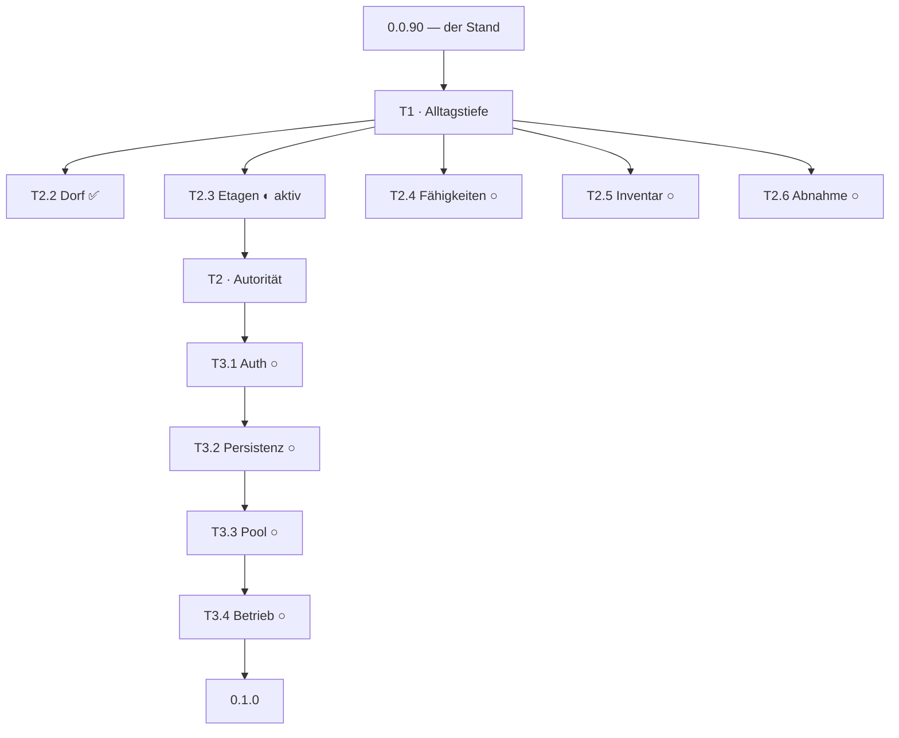

# docs/ENTWICKLERMAP.md — Von hier nach 0.1.0

> **Was diese Datei ist.** Die Roadmap sagt, *was* gilt. Diese Datei sagt, *wo du
> stehst* und welcher Schritt als nächster kommt. Sie ist aus `docs/ROADMAP.md`
> rekursiv abgeleitet: jeder Track führt seine Slices, jeder Slice seine Prüfpunkte.
> Kein Schritt steht hier, der nicht in der Roadmap oder in einem
> `docs/CONCEPT_REVIEW.md` belegt ist.
>
> **Was sie nicht ist.** Kein Plan, kein Wunsch, keine erfundene Zahl. Wo ein Wert
> `[K]` ist, steht hier `[K]` — die Klammern wandern mit, wenn sie wandern müssen.

  

## Der Stand in einem Satz

Der deterministische Kampf steht, die Dorf- und Etagenwirtſchaft rechnet, und
seit dem 2026-09-29 **gewinnen Helden**: der Referenzkampf liegt bei 88 %.

## Wie man hier liest

Die Karte ist ein Baum. `Track` → `Slice` → `Prüfpunkt`. Ein Slice ist fertig,
wenn alle seine Prüfpunkte grün sind; ein Track ist fertig, wenn seine Slices es
sind. Der aktive Slice ist der einzige, an dem gerade gearbeitet wird.

## Legende

| Zeichen | Bedeutung |
| --- | --- |
| ✅ | gebaut, belegt, im Repo |
| ◐ | aktiv — angefangen, nicht fertig |
| ○ | geplant, serielle Reihenfolge, nichts angefasst |
| 🔒 | wartet auf eine Freigabe, die nicht im Repo steht |

---

## T1 — Alltagstiefe (ehemals T2)

**Ziel:** Das Dorf wird bewirtschaftet, die Expedition geht über mehrere Etagen,
Heldenfähigkeiten werden Simulationsinputs, und Beute landet im Inventar.
Belegte Quelle: `docs/ROADMAP.md` Abschnitt T1, `docs/VISUAL_GRUNDSATZ.md`.

### T2.1 — Visuals und Zugang ✅

Ressourcenicons, Asset-Loader mit Fallback, drei Render-Modi (Dorf, flacher
Editor, atmosphärischer Raid), Tastaturzugang über DOM-Controls.
Abnahmebeleg: `docs/historisch/2026-09-27_roadmap-t2-1.md`.

### T2.2 — Das Dorf ✅

10×10-Dorf, Platzierung und Ausbau von Häusern und Werkstätten, horizontales Land,
Rückkehrabrechnung mit Toast. Fertig, seitdem der Rückkehr-Toast über
`daySettlement` steht — nicht als Anzeige mit eigenem Merker, sondern als
Ableitung an der Phasenguarde, die den Tag bucht.

Gebaut: `village/state.ts` (Owner), `balance.ts` (einzige Zahlenquelle),
`economy.ts` (reine Rechnung), `plot.ts` (Geometrie), `commands.ts` (Bau-, Ausbau-
und Landkommando), `ui/settlement-toast.tsx` (Rückkehr).

### T2.3 — Etagen-Expedition ◐ **aktiv**

**Was steht:** der Etage-Kauf mit quadratischem Preis (`floorBase` 250 Gold ab
Etage 2), die Anzeige im Tag-Panel, und die Verdrahtung der Etage in den Auftrag.
Der Probelauf liest `dayNight.value.village.floors`; der Replay-Pfad liest
weiter die eingefrorene Konstante — zwei Fragen, zwei Quellen.

**Was fehlt, in dieser Reihenfolge:**

1. **Die Bedienung.** `buildBuilding`, `upgradeBuilding` und `extendLand` haben ein
   Kommando und keinen Aufrufer im Spielerpfad. Der Motor ist gebaut, die
   Bedienung nicht. Das ist keine Balancefrage, das ist eine fehlende Naht.
2. **Boss-Aussteigen/Weitergehen.** Hängt an den Stärke-Schwellen.
3. **Escrow für ungesicherte Beute.** Von 1 und 2 unabhängig, keine `[K]`-Zahl.
4. **Bestätigung der Stärke-Schwellen.** 🔒 Die Skala ist gemessen und definiert
   (`genome/strength.ts`), die Schwellen selbst sind `[K]`.

### T2.4 — Klassenfähigkeiten ○

Heal, Direktschaden und Team-Buff als deterministische Simulationsinputs am
nächsten ganzzahligen Tick, je Held einmal pro Expedition. Braucht einen
abgestimmten Contract-Sprung — der Slot ist inzwischen von v9 belegt.

**Reihenfolge darin:** erst das Vokabular (steht, `abilities.ts`), dann die
**Zuordnung Held → Klasse** aus dem eingefrorenen Stand, dann die Zahlen der
Klassenboni und Fähigkeitsstärken an ihrer Quelle im Core, und erst dann der
Slice. Die Engine schreibt bis dahin ausschließlich `none`.

🔒 Die Zählregel ist widersprüchlich und muss vorher entschieden werden: Abschnitt
0a sagt „je Held einmal pro Expedition", der Statusblock daneben nennt 1/2/3 mal
je Etage. Zwei Zählungen, eine Fähigkeit.

### T2.5 — Inventar und Drops ○

Neun Inventarplätze, ein separater Unique-Slot je Held, seeded Bossdrops,
Duplikatschutz, sicher vorgemerkter Drop bei vollem Rucksack.

🔒 Drop-Pool und Roll-Gewichte sind `[K]`. Ohne die Freigabe wird hier nichts
gebaut — die Mechanik ohne Zahl wäre eine Lüge in Zahlenkleidung.

### T2.6 — Browser-Abnahme ○ 🔒

Accessibility, Asset-Fallback, Stadtbau, Ausstieg und Niederlage, Einmalabrechnung
— im echten Browser geprüft. **In der Arbeitsumgebung gibt es derzeit weder Chrome
noch ein DOM-Testsetup.** Das ist ein Werkzeugblocker, kein Codeblocker.

---

## T2 — Autorität (ehemals T3)

**Ziel:** Online-Autorität und persistierter Fortschritt. Startet erst, wenn T1
durch ist; Online-Belohnungen bleiben gesperrt, bis Authentifizierung und
Replay-Prüfung durchgesetzt sind.

### T3.1 — Firebase-Auth ○ 🔒

Google- und E-Mail-Anmeldung, Firebase-UID als Kontoschlüssel, isolierte
Dev-Umgebung mit Dev-Wipe-Sperre. **Projektwerte kommen vom Nutzer, nicht aus dem
Repository.** Es wird nichts provisioniert.

### T3.2 — Persistenz und Replay-Gate ○

Profil-, Stadt-, Etagen-, Inventar- und Run-Checkpoints. Der Server replayt
Freeze, Seed und Input **vor** jedem atomaren Reward-Commit; Retry ist idempotent.
Das ist der Block, in dem das Determinismus-Versprechen endlich bezahlt wird.

### T3.3 — Pool und Matching ○ 🔒

Zielauswahl, Self-Match-Sperre, deterministischer Ghost bei leerem Pool. Das
MMR-Band wird nicht geraten — es braucht eine Freigabe.

### T3.4 — Betriebsabnahme ○

Emulator- und Testdaten, Security-Fälle, vollständige Gates. Echte Cloud- und
D1-Provisionierung bleibt separat freigegeben.

---

## Was quer zu allen Tracks liegt

Diese Punkte haben keinen Slice, sondern einen Besitzer. Sie tauchen auf, sobald
der Track aufgeht, der sie braucht.

| Punkt | Besitzer | Stand |
| --- | --- | --- |
| Kampfbalance | `sim-core` | ✅ freigegeben und gebaut, 88 % im Referenzkampf |
| Helden-/Monsterbasis | `sim-core` | `[K]` — bleibt, bis eine Messung es verlangt |
| Goldformel | `client` | ✅ freigegeben, Transport und Rückweg geschlossen |
| Stärke-Schwellen | `sim-core` | `[K]`, in den Lücken der gemessenen Verteilung |
| Attraktivität | `client` | angezeigte Startbasis, aber keine Ableitung |
| D1-Provisionierung | `server` | nicht provisioniert, nur In-Memory-SQLite geprüft |
| Deklarationslücke | Gate | kein Gate prüft `@floor/*` in den `package.json`-Dependencies |

---

## Die drei Fallen, die schon zweimal Zeit gekostet haben

- **Der erste Golden-Pin ist der teuerste Messfaden im Repo.** Eine Zahl zu ändern,
  die keinen Lauf entscheidet, verschiebt ihn trotzdem. Der Senkungsversuch der
  Heldenbasis am 2026-09-29 hat genau das getan und wurde zurückgenommen.
- **Ein Migrations-Test gehört nicht an die laufende Konstante.** `007_contract_v9.sql`
  ist eine Momentaufnahme des Sprungs 8→9 und stempelt für immer `'0.0.8'`.
- **Heredocs mit Umlauten zerbrechen.** Commit-Bodies mit `printf` schreiben.

## Wo die Zahlen stehen

| Was | Wo |
| --- | --- |
| Kampfbalance und Bosswerte | `packages/sim-core/src/combat/boss.ts`, `src/units.ts` |
| Goldformel | `docs/GOLDFORMEL.md`, Zahlen in `client/src/village/balance.ts` |
| Dorfbalance | `client/src/village/balance.ts` — die einzige Zahlenquelle des Dorfs |
| Spielregeln | `docs/CONCEPT_REVIEW.md` — `[N]` fix, `[K]` Vorschlag, `[O]` offen |
| Messwerkzeug | `sim-core/src/combat/balance-report.test.ts` |
| Versionsstände | `packages/contracts/src/version.ts` — `sim_version`, `CONTRACT_VERSION` |
